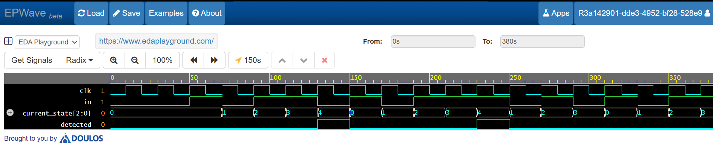

# Moore FSM Sequence Detector for Bit Pattern 1011

## Overview

This project implements a Moore Finite State Machine (FSM) based sequence detector designed to detect the bit pattern 1011 in a serial input stream.

The design was implemented using Verilog HDL and verified through simulation using a dedicated testbench and waveform analysis.

## Features

- Moore FSM implementation
- Detects the sequence 1011
- Verilog HDL design
- Testbench-based verification
- Waveform analysis for validation

## Tools Used

- Verilog HDL
- EDA Playground
- EPWave

## Project Structure

```text
rtl_code/
    sequence_detector_1011_moore.v

testbench/
    tb_sequence_detector_1011_moore.v

simulation/
    waveform_output.png
```

## FSM States

| State | Meaning |
|---------|---------|
| S0 | Initial State |
| S1 | Detected '1' |
| S2 | Detected '10' |
| S3 | Detected '101' |
| S4 | Detected '1011' |

The output is asserted when the FSM reaches State S4.

## Simulation Result



The waveform confirms successful detection of the target sequence 1011. The `detected` signal becomes high whenever the complete sequence is identified.

## Verification

A Verilog testbench was developed to:

- Generate clock signals
- Apply input sequences
- Verify state transitions
- Confirm correct detection output

## Author

Beema Shahana Shiyad
